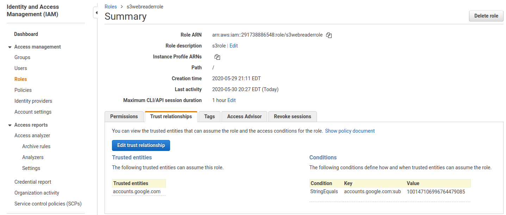
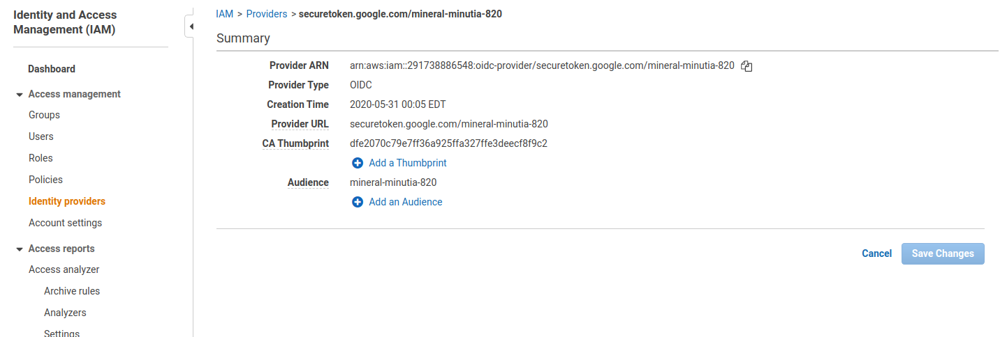
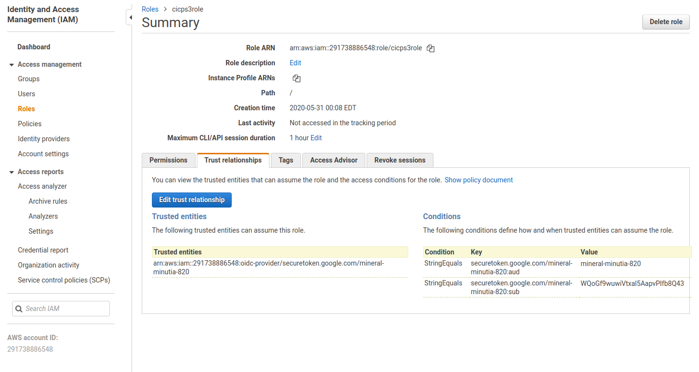

### Google and Firebase OIDC tokens for AWS STS


Simple Golang [AWS Credential Provider](https://docs.aws.amazon.com/sdk-for-go/api/aws/credentials/) that uses [Google OIDC tokens](https://github.com/salrashid123/google_id_token).

The code snippet below and library will acquire a Google OIDC token, exchange it for an AWS STS token and surface that as AWS Credential object.

Essentially, this is a golang snippet and configuration that uses AWS's [IAM Role using External Identities](https://docs.aws.amazon.com/IAM/latest/UserGuide/id_roles_create_for-user_externalid.html).  The code below wraps exchanges a Google OIDC tokens with AWS STS endpoint and finally configures the acquired credentials in a format that is usable for any AWS standard service library.

[Firebase](https://firebase.google.com/) and [Google Cloud Identity Platform](https://cloud.google.com/identity-platform/docs) based `id_tokens` can also be uses for this exchange but is not wrapped into this library (critically since there isn't a golang client library to acquire them).  

### References

#### AWS
- [AWS Identity Providers and Federation](https://docs.aws.amazon.com/IAM/latest/UserGuide/id_roles_providers.html)
- [AWS WebIdentityRoleProvider](https://docs.aws.amazon.com/sdk-for-go/api/aws/credentials/stscreds/#WebIdentityRoleProvider)
- [AWS AssumeRoleWithWebIdentity](https://docs.aws.amazon.com/sdk-for-go/api/service/sts/#STS.AssumeRoleWithWebIdentity)
- [aws.credential.Provider](https://godoc.org/github.com/aws/aws-sdk-go/aws/credentials#Provider)

#### Google
- [Authenticating using Google OpenID Connect Tokens](https://github.com/salrashid123/google_id_token)
- [Securely Access AWS Services from Google Kubernetes Engine (GKE)](https://blog.doit-intl.com/securely-access-aws-from-gke-dba1c6dbccba)
- [https://accounts.google.com/.well-known/openid-configuration](https://accounts.google.com/.well-known/openid-configuration)


#### Firebase
- [Firebase Storage and Authorization Rules engine 'helloworld'](https://blog.salrashid.me/posts/firebase_storage_rules/)


### Google OIDC

AWS already supports Google OIDC endpoint out of the box as a provider so the setup is relatively simple: just define an AWS IAM policy that includes google and restrict it with a `Condition` that allows specific external identities as shown below:


- The following definition refers to Role: `arn:aws:iam::291738886548:role/s3webreaderrole`

```json
{
  "Version": "2012-10-17",
  "Statement": [
    {
      "Effect": "Allow",
      "Principal": {
        "Federated": "accounts.google.com"
      },
      "Action": "sts:AssumeRoleWithWebIdentity",
      "Condition": {
        "StringEquals": {
          "accounts.google.com:sub": "100147106996764479085"
        }
      }
    }
  ]
}
```




To do this by hand, first acquire an ID token (in this case through `gcloud` cli and service account):

```bash
$ gcloud auth activate-service-account --key-file=/path/to/gcp_service_account.json

$ export TOKEN=`gcloud auth print-identity-token --audiences=https://foo.bar`
```

Decode the token using the JWT decoder/debugger at [jwt.io](jwt.io)

The token will show the unique `sub` field that identifies the service account:

```json
{
  "aud": "https://foo.bar",
  "azp": "svc-2-429@mineral-minutia-820.iam.gserviceaccount.com",
  "email": "svc-2-429@mineral-minutia-820.iam.gserviceaccount.com",
  "email_verified": true,
  "exp": 1590898991,
  "iat": 1590895391,
  "iss": "https://accounts.google.com",
  "sub": "100147106996764479085"
}
```

Or using gcloud cli again:

```bash
$ gcloud iam service-accounts describe svc-2-429@mineral-minutia-820.iam.gserviceaccount.com
    displayName: Service Account A
    email: svc-2-429@mineral-minutia-820.iam.gserviceaccount.com
    etag: MDEwMjE5MjA=
    name: projects/mineral-minutia-820/serviceAccounts/svc-2-429@mineral-minutia-820.iam.gserviceaccount.com
    oauth2ClientId: '100147106996764479085'
    projectId: mineral-minutia-820
    uniqueId: '100147106996764479085'
```

Use this `uniqueId` value in the AWS IAM Role policy as shown above.

  (Note, I tried to specify an audience value (`"accounts.google.com:aud": "https://someaud"`) but that didn't seem to work)


Export the token and invoke the STS endpoint using the `RoleArn=` value defined earlier

```bash
export TOKEN=eyJhbGciOiJSUzI1...

$ curl -s "https://sts.amazonaws.com/?Action=AssumeRoleWithWebIdentity&DurationSeconds=3600&RoleSessionName=app1&RoleArn=arn:aws:iam::291738886548:role/s3webreaderrole&WebIdentityToken=$TOKEN&Version=2011-06-15&alt=json"
```

You should see AWS `Credential` object in the response
```xml
<AssumeRoleWithWebIdentityResponse xmlns="https://sts.amazonaws.com/doc/2011-06-15/">
  <AssumeRoleWithWebIdentityResult>
    <Audience>svc-2-429@mineral-minutia-820.iam.gserviceaccount.com</Audience>
    <AssumedRoleUser>
      <AssumedRoleId>AROAUH3H6EGKKRVTHVAVB:app1</AssumedRoleId>
      <Arn>arn:aws:sts::291738886548:assumed-role/s3webreaderrole/app1</Arn>
    </AssumedRoleUser>
    <Provider>accounts.google.com</Provider>
    <Credentials>
      <AccessKeyId>ASIAUH3H6EGKPI...</AccessKeyId>
      <SecretAccessKey>EM3Zu4RlDOKGkFPJpceemRqEzfazLk...</SecretAccessKey>
      <SessionToken>FwoGZXIvYXd...</SessionToken>
      <Expiration>2020-05-31T04:23:39Z</Expiration>
    </Credentials>
    <SubjectFromWebIdentityToken>100147106996764479085</SubjectFromWebIdentityToken>
  </AssumeRoleWithWebIdentityResult>
  <ResponseMetadata>
    <RequestId>38dd604d-6ce2-45b3-8e6f-1165ae0e24a1</RequestId>
  </ResponseMetadata>
</AssumeRoleWithWebIdentityResponse>
```

You can manually export the `Credential` in an cli (in this case, to access `s3`)

```bash
export AWS_ACCESS_KEY_ID=ASIAUH3H6EGKIL...
export AWS_SECRET_ACCESS_KEY=+nDF8O2yLDH13ug...
export AWS_SESSION_TOKEN=FwoGZXIvYXd...

$ aws s3 ls mineral-minutia --region us-east-2

    2020-05-29 23:04:07        213 main.py

```

To make this easier, the golang library contained in this repo wraps these steps and provides an AWS `Credential` object for you:

```golang
package main

import (
	"context"
	"fmt"

	"log"

	"github.com/aws/aws-sdk-go/aws"
	"github.com/aws/aws-sdk-go/aws/session"
	"github.com/aws/aws-sdk-go/service/s3"
	"github.com/aws/aws-sdk-go/service/sts"

  "github.com/salrashid123/awscompat/google"
	"google.golang.org/api/idtoken"
)

const ()


func main() {

	aud := "https://foo.bar"
	jsonCert := "/path/to/svc.json"

	ctx := context.Background()

	ts, err := idtoken.NewTokenSource(ctx, aud, idtoken.WithCredentialsFile(jsonCert))
	if err != nil {
		log.Fatalf("unable to create TokenSource: %v", err)
	}

	creds, err := google.NewGCPAWSCredentials(ts, &sts.AssumeRoleWithWebIdentityInput{
		RoleArn:         aws.String("arn:aws:iam::291738886548:role/s3webreaderrole"),
		RoleSessionName: aws.String("app1"),
	})
	if err != nil {
		log.Fatalf("Error creatint Credentials  %v", err)
	}

	sess, err := session.NewSession(&aws.Config{
		Credentials: &creds,
		Region:      aws.String("us-east-2")},
	)
	svcs3 := s3.New(sess)

	sresp, err := svcs3.ListObjectsV2(&s3.ListObjectsV2Input{Bucket: aws.String("mineral-minutia")})
	if err != nil {
		log.Fatalf("Error listing objects:  %v", err)
	}

	for _, item := range sresp.Contents {
		fmt.Println("Name:         ", *item.Key)
	}

}
```

Just note `"google.golang.org/api/idtoken"` will only provide `id_tokens` for service accounts.   It does not support user-based id_tokens.

---

### Firebase/Cloud Identity OIDC

Firebase and Cloud Identity can also provide OIDC tokens.  For example, the OIDC `.well-known` endpoint below for a given Firebase Project is discoverable by AWS as an external provider:

For my Firebase/Cloud Identity Project (it just happens to be called `mineral-minutia-820`:

- [https://securetoken.google.com/mineral-minutia-820/.well-known/openid-configuration](https://securetoken.google.com/mineral-minutia-820/.well-known/openid-configuration)


and compare that with the full OIDC capabilities of google:

- [https://accounts.google.com/.well-known/openid-configuration](https://accounts.google.com/.well-known/openid-configuration)

But thats enough to get started.  Unfortunately, there doesn't seem to be a golan library to wrap as shown earlier.   The following shows how to get a Firebase id_token using its nodeJS library using plain `firebase.auth().signInWithEmailAndPassword`

```javascript
require("firebase/auth");

const email = "your@email.com";
const password = "yourpassword";
var firebaseConfig = {
    apiKey: "...",
    authDomain: "...",
    projectId: "...",
    storageBucket: "...",    
  };
  
firebase.initializeApp(firebaseConfig);
firebase.auth().signInWithEmailAndPassword(email, password).then(result => {
  firebase.auth().currentUser.getIdToken(true).then(function(idToken) {
    console.log(idToken);
  }
}
```

Once you have the id_token, decode as done earlier to fin the `sub` value.  THis will be unqiue to each Firebase project even if the same actual user logs into multiple projects.


[Firebase Storage and Authorization Rules engine 'helloworld'](https://blog.salrashid.me/posts/firebase_storage_rules/)

First define an external provider:



When you specify the endpoint configuration for OIDC, just use the root URL for the discovery endpoint with the firebase projectID: `https://securetoken.google.com/mineral-minutia-820`

Then define a Role with the external provider:  in my case the role was `arn:aws:iam::291738886548:role/cicps3role`



```json
{
  "Version": "2012-10-17",
  "Statement": [
    {
      "Effect": "Allow",
      "Principal": {
        "Federated": "arn:aws:iam::291738886548:oidc-provider/securetoken.google.com/mineral-minutia-820"
      },
      "Action": "sts:AssumeRoleWithWebIdentity",
      "Condition": {
        "StringEquals": {
          "securetoken.google.com/mineral-minutia-820:aud": "mineral-minutia-820",
          "securetoken.google.com/mineral-minutia-820:sub": "WQoGf9wuwiVtxal5AapvPIfb8Q43"
        }
      }
    }
  ]
}
```

The `sub` value is taken from the decoded `id_token`

```json
{
  "name": "sal a mander",
  "admin": true,
  "groupId": "12345",
  "iss": "https://securetoken.google.com/mineral-minutia-820",
  "aud": "mineral-minutia-820",
  "auth_time": 1590897853,
  "user_id": "WQoGf9wuwiVtxal5AapvPIfb8Q43",
  "sub": "WQoGf9wuwiVtxal5AapvPIfb8Q43",
  "iat": 1590897853,
  "exp": 1590901453,
  "email": "sal@somedomain.com",
  "email_verified": false,
  "firebase": {
    "identities": {
      "email": [
        "sal@somedomain.com"
      ]
    },
    "sign_in_provider": "password"
  }
}
```

As mentioned, the there is no golang library for FireBase so a direct invocation w/ curl will yeld the AWS Credential.

```bash
$  curl -s "https://sts.amazonaws.com/?Action=AssumeRoleWithWebIdentity&DurationSeconds=3600&RoleSessionName=app1&RoleArn=arn:aws:iam::291738886548:role/cicps3role&WebIdentityToken=$TOKEN&Version=2011-06-15&alt=json"
```

```xml
<AssumeRoleWithWebIdentityResponse xmlns="https://sts.amazonaws.com/doc/2011-06-15/">
  <AssumeRoleWithWebIdentityResult>
    <Audience>mineral-minutia-820</Audience>
    <AssumedRoleUser>
      <AssumedRoleId>AROAUH3H6EGKDE7GWMPWA:app1</AssumedRoleId>
      <Arn>arn:aws:sts::291738886548:assumed-role/cicps3role/app1</Arn>
    </AssumedRoleUser>
    <Provider>arn:aws:iam::291738886548:oidc-provider/securetoken.google.com/mineral-minutia-820</Provider>
    <Credentials>
      <AccessKeyId>ASIAUH3H6EGKPJ...</AccessKeyId>
      <SecretAccessKey>Z3S78e6hWYGlub6YlOgz6hYwo81...</SecretAccessKey>
      <SessionToken>FwoGZXIvYXd...</SessionToken>
      <Expiration>2020-05-31T05:11:05Z</Expiration>
    </Credentials>
    <SubjectFromWebIdentityToken>WQoGf9wuwiVtxal5AapvPIfb8Q43</SubjectFromWebIdentityToken>
  </AssumeRoleWithWebIdentityResult>
  <ResponseMetadata>
    <RequestId>5959ed62-13ac-4205-a0f6-811f00bced6b</RequestId>
  </ResponseMetadata>
</AssumeRoleWithWebIdentityResponse>
```

One more note about Firebase/Cloud Identity:  You can use it to define external identities itself (eg, Google, Facebook, AOL, other OIDC, other SAML, etc).  That means you can chain identities together though Identity Platform.   Turtles all the way down (or atleast a couple of levels).
